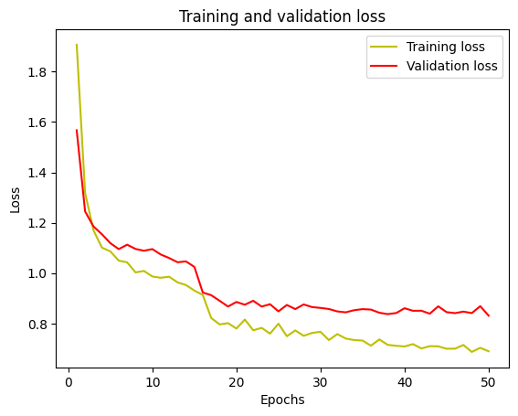
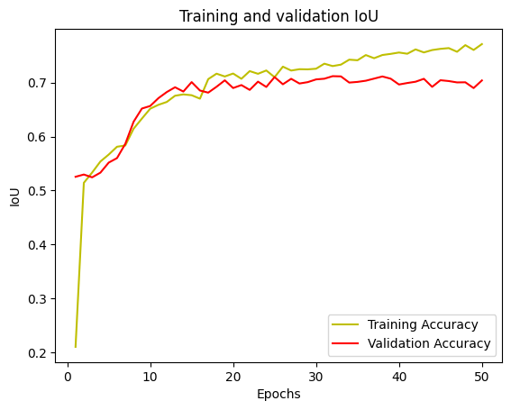
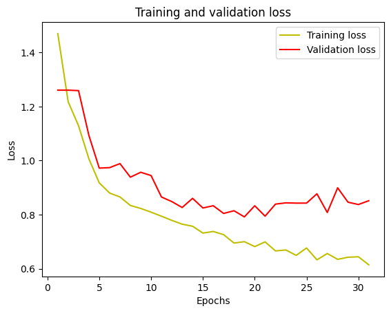
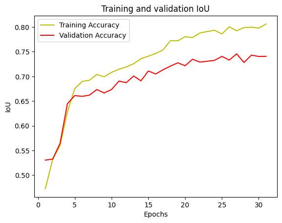
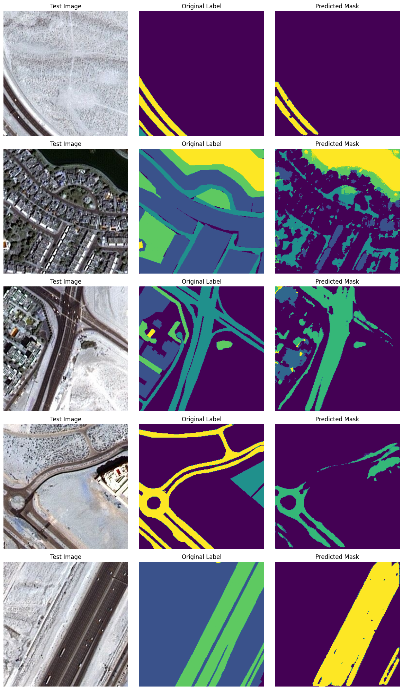
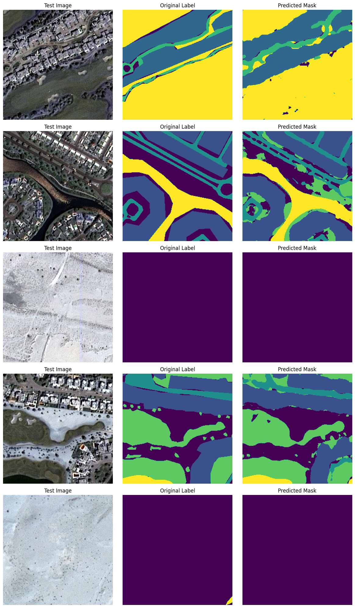

Certainly! Here's an updated version of the README.md file content for a Google Colab project:

# Satellite Image Segmentation

This project focuses on satellite image segmentation using deep learning techniques. The goal is to accurately classify and segment different objects and regions within satellite imagery, enabling various applications such as land cover mapping, urban planning, and environmental monitoring.

## Table of Contents

- [Introduction](#introduction)
- [Usage](#usage)
- [Data](#data)
- [Model Architecture](#model-architecture)
- [Training](#training)
- [Results](#results)
- [Contributing](#contributing)
- [License](#license)

## Introduction

In this project, we implement a deep learning approach to perform pixel-wise semantic segmentation on satellite imagery using Google Colab. The segmentation model is trained to accurately classify each pixel into predefined classes, enabling the identification and delineation of different objects and land cover types within the images.

## Usage

1. Open the Google Colab notebook file `satellite_image_segmentation.ipynb` in Google Colab.
2. Use runtime as GPU for Faster training and better computing resources
3. Modify the notebook as needed, such as adjusting the configuration parameters and paths to your dataset.
4. Run the notebook cells to execute the code and perform satellite image segmentation.
5. Monitor the execution and analyze the results obtained.

## Data

The dataset used for this project consists of satellite imagery and corresponding ground truth masks. Make sure to organize the dataset properly before running the notebook.

Ensure that the images and masks have the same filenames and are aligned correctly.

I have added the dataset in this repository.

## Model Architecture

The model architecture used for satellite image segmentation is a modified version of the UNet model. It consists of an encoder and a decoder with skip connections to capture both low-level and high-level features in the images.

## Training

The notebook includes the training process for the segmentation model. It involves loading the dataset, preprocessing the data, defining the model architecture, compiling the model, and training the model on the dataset. Adjust the hyperparameters, such as learning rate and batch size, as needed for optimal training.

## Results

The notebook generates results and evaluation metrics for the trained segmentation model. These include accuracy, loss, and visualizations of the segmented satellite imagery. Analyze the results to assess the model's performance and make any necessary improvements.

| Simple-UNet loss                      | Simple-UNet IoU                          | Multi-UNet loss                      | Multi-UNet IoU                           |
|---------------------------------------|------------------------------------------|--------------------------------------|------------------------------------------|
|   |  |  |  |

#Output Images :

| Simple-UNet predictions               | Multi-UNet predictions                   |
|---------------------------------------|------------------------------------------|
|   |  |

## Contributing

Contributions to this project are not currently being accepted as it is a personal project.

## License

This project is licensed under the [MIT License](LICENSE).

Please modify the content according to your project's specific details and provide appropriate links and references.
